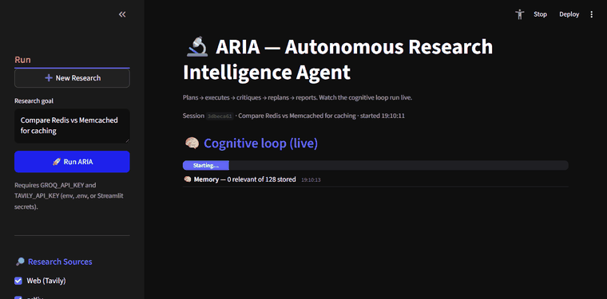

# 🔬 ARIA — Autonomous Research Intelligence Agent

> Plans → executes → critiques → replans → reports.
> Watch the cognitive loop run live at [agent-aria.streamlit.app](https://agent-aria.streamlit.app)


---

## What is ARIA?

ARIA is an autonomous research agent built on **LangGraph**. You give it a
research question. It breaks the question into subtasks, searches across four
sources in parallel (**Web · arXiv · Wikipedia · GitHub**), scores each finding
across 4 dimensions, replans only the weak ones, and produces a structured,
multi-section report with inline sources and one-click PDF export. Every run is
saved to a resumable session history.

**This is not a chatbot.** It is a cognitive loop you can watch run in real time
in a monospace "blueprint" console UI.

---

## Live Demo



*A real run in the Streamlit UI (blueprint theme): you type a question, ARIA
plans it into subtasks and streams the **cognitive loop live** — each executor
search, critic score, and replan appears as it happens with a running progress
bar — then renders a structured, sourced report you can export to PDF. Sources
(Web · arXiv · Wikipedia · GitHub) are toggleable, and every past run is saved
to a resumable history.*

🔗 **Try it live:** [agent-aria.streamlit.app](https://agent-aria.streamlit.app)

---

## Architecture


### The Cognitive Loop

```
Memory Reader → Planner → Executor → Critic → [Replan?] → Memory Writer → Terminator → Report
                             ▲___________ replans only the failing subtask __________|
```

### How the Critic Works

Each finding is scored across 4 dimensions using **structured output (Pydantic)**,
not regex:

| Dimension | What it measures |
| --- | --- |
| Relevance | How relevant the finding is to the research goal (0-10) |
| Specificity | How specific vs vague (0-10) |
| Source Quality | Credibility of the sources found (0-10) |
| Completeness | How completely the subtask is answered (0-10) |

If **overall < 7**: a targeted replan of *that subtask only* (capped at
`max_replans = 2`). If **overall ≥ 7**: move to the next task.

### Research Sources

Queried in parallel, deduplicated by URL, ranked by relevance, and attributed
(`[Web]`, `[arXiv]`, `[Wikipedia]`, `[GitHub]`) in every finding.

| Source | What it searches | API key |
| --- | --- | --- |
| Web (Tavily) | Live web search | Required (`TAVILY_API_KEY`) |
| arXiv | Academic papers | None |
| Wikipedia | Encyclopedia | None |
| GitHub | Open-source repos | Optional (`GITHUB_TOKEN`, raises rate limit) |

### State Machine

The graph shares a typed `AgentState`. A custom `merge_results` reducer keys
findings by a stable id, so scores update in place instead of duplicating:

```python
class AgentState(TypedDict):
    goal: str
    subtasks: list[str]
    current_task_index: int
    results: Annotated[list[dict], merge_results]  # custom reducer — no duplicates
    memory_context: str
    memory_stats: dict
    final_report: str
    replan_count: int
    max_replans: int          # caps replan loops (default 2)
    session_id: str
    enabled_sources: list[str]
```

---

## Real Results

Run ARIA on unrelated topics to demonstrate it generalizes (no hardcoded
knowledge — every finding is live search):

```bash
python scripts/run_examples.py   # requires your GROQ + TAVILY keys
```

Two committed sample runs live in [`examples/`](examples/). Populate the table
below from `examples/RESULTS.md`:

| Topic | Subtasks | Avg critic score | Replan cycles | Sources used |
| --- | --- | --- | --- | --- |
| Compare Redis vs Memcached | _run to fill_ | _run to fill_ | _run to fill_ | _run to fill_ |
| What is retrieval augmented generation | _run to fill_ | _run to fill_ | _run to fill_ | _run to fill_ |
| How does transformer attention work | _run to fill_ | _run to fill_ | _run to fill_ | _run to fill_ |

---

## Setup

### Prerequisites
- Python 3.10+
- `GROQ_API_KEY` — free at [console.groq.com](https://console.groq.com)
- `TAVILY_API_KEY` — free at [app.tavily.com](https://app.tavily.com)

### Run locally
```bash
git clone https://github.com/Aarti-panchal01/aria-agent
cd aria-agent
pip install -e ".[dev,ui]"
cp .env.example .env          # add your keys
streamlit run ui/app.py
```

### Deploy to Streamlit Cloud
1. Fork this repo.
2. Go to [share.streamlit.io](https://share.streamlit.io).
3. Select this repo, main file: **`ui/app.py`**.
4. Add `GROQ_API_KEY` and `TAVILY_API_KEY` as secrets
   (see [`.streamlit/secrets.toml.example`](.streamlit/secrets.toml.example)).
5. Deploy.

---

## Testing

```bash
pytest -v          # 32 tests (unit + full-graph integration)
ruff check .       # lint
```

CI runs both on every push to `main` (Python 3.10 + 3.12). The integration
tests exercise the full compiled graph and assert: no duplicate findings, one
finding per subtask, no crash on search failure, and well-formed tables.

See [`LIMITATIONS.md`](LIMITATIONS.md), [`CHANGELOG.md`](CHANGELOG.md), and
[`SECURITY.md`](SECURITY.md) for the honest details.

---

## Built by

**Aarti Panchal** — 19-year-old AI/ML engineer at PES University, Bengaluru.
C4GT 2026 Fellow · Product Engineer at Inverix · Founder of Closeli.

[Portfolio](https://aarti-tech-portfolio.vercel.app) ·
[LinkedIn](https://linkedin.com/in/aarti-panchal-93196a319) ·
[GitHub](https://github.com/Aarti-panchal01)

---

## Citation

```bibtex
@software{panchal2026aria,
  author = {Panchal, Aarti},
  title  = {ARIA: Autonomous Research Intelligence Agent},
  year   = {2026},
  url    = {https://github.com/Aarti-panchal01/aria-agent}
}
```

## License

MIT — see [LICENSE](LICENSE).
