# ARIA — Autonomous Research Intelligence Agent

> A LangGraph-powered research agent that plans, searches, critiques, remembers, and reports — autonomously.

---

## How It Works

ARIA operates as a **stateful cognitive loop**, where each node performs a specialized task:

1. **Memory Reader** — Checks ChromaDB for past findings related to the research goal
2. **Planner** — Breaks the research goal into 6 concrete, actionable subtasks
3. **Executor** — Searches the web (Tavily API) for each subtask and prepends framework-specific knowledge
4. **Critic** — Scores each result on a 0-10 scale for relevance and quality
5. **Replanner** — If average score < 7, creates better subtasks and tries again
6. **Memory Writer** — Saves all findings to ChromaDB for future sessions
7. **Report Generator** — Synthesizes findings into a structured markdown report with comparison tables

The loop continues until the critic is satisfied (score ≥ 7 across results) or max iterations reached.

---

## Architecture



**Built with LangGraph StateGraph:**
- **7 nodes** (planner, executor, critic, replanner, memory_reader, memory_writer, report_generator)
- **Conditional edges** based on critic scores and goal completion
- **Persistent AgentState** shared across all nodes
- **Stateful memory** via ChromaDB vector store

---

## Features

✨ **Stateful cognitive loop** with LangGraph — agents remember context across steps

🧠 **Self-critic that scores and replans** — automatically improves search strategy if quality drops below 7/10

💾 **Persistent memory across sessions** — ChromaDB stores findings for future reference

🔍 **Web search integration** — Tavily API for real-time research data

📊 **Structured markdown reports** — Comparison tables with aligned columns

📋 **Full reasoning trace** — Complete decision log saved as JSON for transparency

💰 **100% free** — Groq API + Llama 3.1 8B (no paid services required)

---

## Tech Stack

| Layer | Technology |
| --- | --- |
| **LLM** | Groq + Llama 3.1 8B Instant |
| **Agent Framework** | LangGraph (StateGraph) |
| **Web Search** | Tavily API |
| **Memory Store** | ChromaDB (local vector database) |
| **Backend** | Python 3.x, LangChain |

---

## Setup

### Quick Start

```bash
git clone https://github.com/Aarti-panchal01/aria-agent
cd aria-agent

# Create virtual environment
python -m venv venv

# Activate venv (Windows)
venv\Scripts\activate

# On macOS/Linux:
# source venv/bin/activate

# Install dependencies
pip install -r requirements.txt
```

### Configure API Keys

Create a `.env` file in the project root:

```env
GROQ_API_KEY=your_groq_api_key_here
TAVILY_API_KEY=your_tavily_api_key_here
```

**Get free API keys:**
- **Groq**: [console.groq.com](https://console.groq.com) — Free tier includes 10K requests/day
- **Tavily**: [app.tavily.com](https://app.tavily.com) — Free tier includes search API access

### Run ARIA

```bash
python main.py
```

Enter your research goal when prompted. ARIA will:
1. Break it into subtasks
2. Search the web for each
3. Score and refine results
4. Save findings to memory
5. Generate a markdown report in `output/report.md`

---

## Project Structure

```
aria-agent/
├── main.py                 # Entry point
├── graph.py                # LangGraph state machine definition
├── state.py                # AgentState schema
├── nodes/
│   ├── planner.py          # Goal → subtasks
│   ├── executor.py         # Subtask → web search results
│   ├── critic.py           # Score results (0-10)
│   ├── memory_reader.py    # Retrieve past findings
│   ├── memory_writer.py    # Save findings to ChromaDB
│   ├── terminator.py       # Check if done
│   └── report_generator.py # Results → markdown report
├── memory/
│   └── chroma_db/          # Local vector store
├── tools/
│   └── search.py           # Tavily web search wrapper
├── output/
│   ├── report.md           # Generated research report
│   └── reasoning_trace.json # Decision log
└── requirements.txt        # Python dependencies
```

---

## Example Output

After running `python main.py` with goal **"LangChain vs LangGraph"**, ARIA generates:

**output/report.md:**
```markdown
Executive Summary

This report compares LangGraph and LangChain agents, two open-source frameworks for building 
LLM-powered applications. The key differences between the two frameworks are identified, 
including their workflow types, architectures, and state management capabilities. LangGraph 
is more suitable for stateful, multi-agent applications, while LangChain is better suited 
for linear, sequential workflows.

Comparison Table

| Dimension           | LangGraph                                                          | LangChain                                              |
| ------------------- | ------------------------------------------------------------------ | ------------------------------------------------------ |
| Workflow Type       | Graph-based (supports loops, branches, cycles, conditional edges)  | Linear, sequential (retrieve, process, respond)       |
| Architecture        | Nodes (functions) + Edges (control flow) + shared AgentState       | Modular components: chains, agents, tools, memory      |
| State Management    | Persistent across steps, sessions, and agents                      | Basic, short-term memory within a single run           |
| Best Use Cases      | Multi-agent systems, human-in-the-loop, long-running agents        | Chatbots, summarization, RAG pipelines, prototypes     |
| Limitations         | Steeper learning curve, more upfront planning needed               | Hits ceiling with complex workflows, stateless         |

Key Conclusions

* LangGraph is more suitable for stateful, multi-agent applications, while LangChain is better suited for linear, 
  sequential workflows.
* LangGraph has persistent state management across steps, sessions, and agents, while LangChain has basic, short-term 
  memory within a single run.
* LangGraph has a steeper learning curve and requires more upfront planning, while LangChain is more straightforward 
  to use.

Key Takeaway

LangGraph and LangChain agents are two distinct frameworks with different strengths and weaknesses, and the choice 
between them depends on the specific requirements of the application being built.
```

**output/reasoning_trace.json:**
Complete decision tree with all search queries, scores, and replanning decisions.

---

## Roadmap

- [ ] Streamlit web UI for visual research interface
- [ ] PDF export for research reports
- [ ] Extended tool ecosystem: code execution, file reading, API calls
- [ ] Multi-agent parallelism for faster research
- [ ] Custom knowledge base ingestion
- [ ] Interactive critiquing with human feedback loop

---

## Author

**Built by Aarti Panchal**

- **Education**: B.Tech AI/ML | PES University, Bangalore (2024–2028)
- **Portfolio**: [aarti-panchal.site](https://aarti-panchal.site/)
- **LinkedIn**: [linkedIn](https://linkedin.com/in/aarti-panchal-93196a319)

---

## License

MIT 

---

**Questions or feedback?** Open an issue on GitHub or reach out directly.
